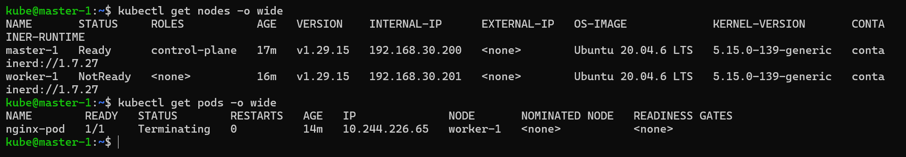
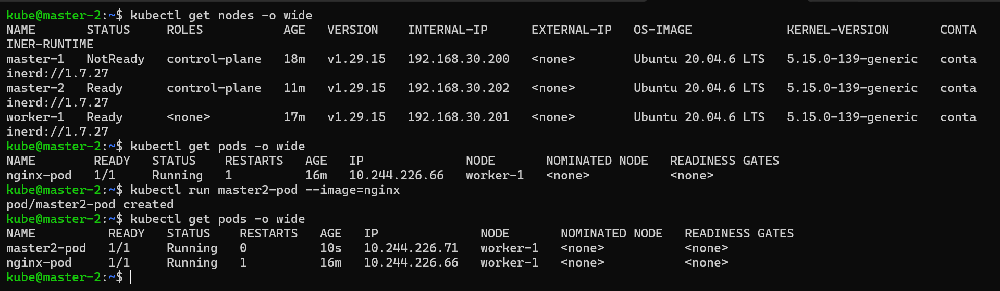

# **Standby Master Automation – Disaster Recovery Document**

*(Cold Standby Control Plane with ETCD Snapshot Restore)*

---

## **Cluster Topology**

| Node Name | Role                  | IP Address     |
| --------- | --------------------- | -------------- |
| master-1  | Primary Control Plane | 192.168.30.200 |
| worker-1  | Worker Node           | 192.168.30.201 |
| master-2  | Standby Control Plane | 192.168.30.202 |

---

## **Objective**

To restore a Kubernetes cluster using an **ETCD snapshot** and promote **master-2** as the new control-plane, while rejoining the worker node automatically using a shell script.

---

## **Phase 1: Primary Master (master-1) – ETCD Backup**

### **Node:** `master-1 (192.168.30.200)`

### **1. Install ETCD Client**

```bash
sudo apt install etcd-client
```

### **2. Verify Cluster Status**

```bash
kubectl get nodes
```

Expected Output:

```text
master-1   Ready    control-plane   5m8s    v1.29.15
worker-1   Ready    <none>          4m40s   v1.29.15
```

### **3. Create a Test Pod**

```bash
kubectl run master1-pod --image=nginx
```

```bash
kubectl get pods
```

Expected Output:

```text
master1-pod   1/1   Running   0   4m40s
```

### **4. Take ETCD Snapshot**

```bash
mkdir etcd-dir
cd etcd-dir
```

```bash
sudo ETCDCTL_API=3 etcdctl snapshot save myback.db \
--cacert=/etc/kubernetes/pki/etcd/ca.crt \
--cert=/etc/kubernetes/pki/etcd/server.crt \
--key=/etc/kubernetes/pki/etcd/server.key
```

### **5. Upload Snapshot to MinIO**

* Uploaded `myback.db` manually via MinIO UI
* **MinIO Endpoint:** `192.168.30.107`

---

## **Phase 2: Standby Master Preparation (master-2)**

### **Node:** `master-2 (192.168.30.202)`

> This node is already prepared to run `kubeadm init`.
> All Kubernetes prerequisites are pre-installed.

### **1. Install ETCD Client**

```bash
sudo apt install etcd-client
```

---

## **Phase 3: MinIO Client Configuration (master-2)**

### **Install MinIO Client**

```bash
wget https://dl.min.io/client/mc/release/linux-amd64/mc
chmod +x mc
sudo mv mc /usr/local/bin/
```

### **Configure MinIO Alias**

```bash
mc alias set myminio http://192.168.30.107:9000 minioadmin minioadmin
mc ls myminio
```

---

## **Phase 4: SSH Configuration**

### **Install SSH Utilities**

```bash
sudo apt install openssh-server openssh-client -y
```

### **Generate SSH Key**

```bash
ssh-keygen -t rsa
```

### **Configure Passwordless SSH to Worker**

```bash
ssh-copy-id kube@192.168.30.201
```

---

## **Phase 5: Kubernetes Init Configuration**

### **File:** `/home/kube/master-2-config.yaml`

```yaml
apiVersion: kubeadm.k8s.io/v1beta3
kind: InitConfiguration
nodeRegistration:
  name: master
  criSocket: unix:///run/containerd/containerd.sock

---
apiVersion: kubeadm.k8s.io/v1beta3
kind: ClusterConfiguration
kubernetesVersion: v1.29.15
etcd:
  local:
    dataDir: /var/lib/etcd
networking:
  podSubnet: 10.244.0.0/16
```

---

## **Phase 6: Worker Node Sudo Configuration**

### **Node:** `worker-1 (192.168.30.201)`

```bash
sudo visudo
```

Add:

```text
kube ALL=(ALL) NOPASSWD:ALL
Defaults:kube !requiretty
```

---

## **Phase 7: Disaster Recovery Script (master-2)**

### **Create Restore Directory**

```bash
mkdir restore
cd restore
```

### **Create Script**

```bash
nano dr_restore.sh
```

### **Script Content**

```bash
#!/bin/bash
set -e

### =========================
### VARIABLES
### =========================
SNAPSHOT_NAME="myback.db"
MINIO_ALIAS="myminio"
MINIO_BUCKET="dr-bucket"
MINIO_PATH="${MINIO_ALIAS}/${MINIO_BUCKET}/${SNAPSHOT_NAME}"

ETCD_DATA_DIR="/var/lib/etcd"
LOCAL_SNAPSHOT_DIR="/home/kube/ETCD"
CONFIG_FILE="/home/kube/master-2-config.yaml"

MASTER_IP="192.168.30.202"
WORKERS=("192.168.30.201")

K8S_VERSION="v1.29.15"

### =========================
### FUNCTIONS
### =========================
log() {
  echo -e "\n\e[1;32m[INFO]\e[0m $1"
}

### =========================
### STEP 1: Download Snapshot
### =========================
log "Creating snapshot directory"
mkdir -p ${LOCAL_SNAPSHOT_DIR}

log "Downloading ETCD snapshot from MinIO"
mc cp ${MINIO_PATH} ${LOCAL_SNAPSHOT_DIR}/${SNAPSHOT_NAME}

### =========================
### STEP 2: Restore ETCD
### =========================
log "Stopping kubelet"
#sudo systemctl stop kubelet

log "Cleaning old ETCD data"
sudo rm -rf ${ETCD_DATA_DIR}

log "Restoring ETCD snapshot"
sudo ETCDCTL_API=3 etcdctl snapshot restore \
  ${LOCAL_SNAPSHOT_DIR}/${SNAPSHOT_NAME} \
  --name master \
  --initial-cluster master=https://${MASTER_IP}:2380 \
  --initial-cluster-token etcd-dr-cluster \
  --initial-advertise-peer-urls https://${MASTER_IP}:2380 \
  --data-dir ${ETCD_DATA_DIR}

### =========================
### STEP 3: Init Control Plane
### =========================
log "Initializing Kubernetes control-plane"
sudo kubeadm init \
  --config ${CONFIG_FILE} \
  --ignore-preflight-errors=DirAvailable--var-lib-etcd

        ### =========================
### STEP 4: Configure kubectl
### =========================
log "Configuring kubectl"
mkdir -p $HOME/.kube
sudo cp /etc/kubernetes/admin.conf $HOME/.kube/config
sudo chown $(id -u):$(id -g) $HOME/.kube/config

### =========================
### STEP 5: Get Join Command
### =========================
log "Generating join command"
JOIN_CMD=$(kubeadm token create --print-join-command)

### =========================
### STEP 6: Reset & Rejoin Workers
### =========================
for WORKER in "${WORKERS[@]}"; do
  log "Resetting worker node: $WORKER"

  ssh kube@$WORKER <<EOF
sudo kubeadm reset -f
sudo systemctl stop kubelet
sudo rm -rf /etc/kubernetes/*
sudo rm -rf /var/lib/kubelet/*
sudo rm -rf /var/lib/cni/*
sudo rm -rf /etc/cni/*
sudo systemctl restart containerd
sudo systemctl start kubelet
EOF

log "Waiting 3-4 minutes before joining worker $WORKER"
sleep 240

  log "Rejoining worker node: $WORKER"
  ssh kube@$WORKER "sudo ${JOIN_CMD}"
done

### =========================
### FINAL STATUS
### =========================
log "Disaster Recovery Completed Successfully!"
kubectl get nodes
kubectl get pods -A
```

---

## **Phase 8: Execute Disaster Recovery**

```bash
chmod 700 dr_restore.sh
./dr_restore.sh
```

---

### Final Outcome Snapshots





## **Result**

* ETCD snapshot restored successfully
* `master-2 (192.168.30.202)` promoted as **new control-plane**
* `worker-1` reset and rejoined automatically
* All workloads restored from ETCD snapshot

---


