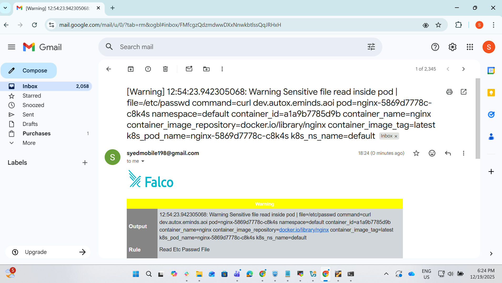

# Falco Kubernetes Deployment and Alerting Setup Guide

## Official Documentation

Falco Kubernetes Quickstart:
[https://falco.org/docs/getting-started/falco-kubernetes-quickstart/](https://falco.org/docs/getting-started/falco-kubernetes-quickstart/)

---

## Prerequisites

Before deploying Falco and Falco Sidekick UI, ensure the following:

* The Kubernetes cluster has the **`local-path` StorageClass** installed.
* The **`local-path` StorageClass must be set as the default**.

  * This is required so that the Redis pod used by Falco Sidekick UI can dynamically provision a Persistent Volume (PV).

### Set `local-path` as Default StorageClass

```bash
kubectl patch storageclass local-path \
  -p '{"metadata":{"annotations":{"storageclass.kubernetes.io/is-default-class":"true"}}}'
```

---

## Falco Installation Steps

### 1. Add Falco Helm Repository

```bash
helm repo add falcosecurity https://falcosecurity.github.io/charts
helm repo update
```

### 2. Install Falco

```bash
helm install --replace falco \
  --namespace falco \
  --create-namespace \
  --set tty=true \
  falcosecurity/falco
```

### 3. Verify Pod Status

```bash
kubectl get pods -n falco -w
```

Ensure that both Falco pods reach the **Running** state with **2/2 containers**.

---

## Validate Falco Using a Test Alert

### 1. Create a Test Deployment

```bash
kubectl create deployment nginx --image=nginx
```

### 2. Execute a Command to Trigger a Falco Rule

```bash
kubectl exec -it $(kubectl get pods --selector=app=nginx -o name) -- cat /etc/shadow
```

### 3. View Falco Logs

```bash
kubectl logs -l app.kubernetes.io/name=falco -n falco -c falco
```

The execution event should appear in the Falco logs, confirming that Falco is actively monitoring runtime activity.

---

## Configure Email Alerting (SMTP)

### Create Kubernetes Secret for SMTP Credentials

```bash
kubectl create secret generic falco-smtp \
  --from-literal=username=syedmobile198@gmail.com \
  --from-literal=password=yeenmjvhbonzzpdx \
  -n falco
```

> **Note:** Use a Gmail App Password, not the actual Gmail account password.

---

## Falco Configuration Values

### `falco-final-values.yaml`

```yaml
############################################
# Custom Falco Rules
############################################
customRules:
  runtime-security-rules.yaml: |-
    - rule: Kubernetes Pod Exec
      desc: Detects shell execution inside a Kubernetes pod
      condition: >
        evt.type=execve and
        k8s.ns.name!="" and
        proc.name in (bash, sh, zsh, ash)
      output: >
        K8s pod exec detected |
        user=%user.name
        command=%proc.cmdline
        pod=%k8s.pod.name
        namespace=%k8s.ns.name
        container=%container.name
      priority: WARNING
      tags: [kubernetes]

    - rule: Read Etc Passwd File
      desc: Detects read access to /etc/passwd inside Kubernetes pods
      condition: >
        evt.type in (open, openat, openat2) and
        fd.name="/etc/passwd" and
        evt.is_open_read=true and
        k8s.ns.name!="" and
        not proc.name in (runc, containerd, dockerd, crio)
      output: >
        Sensitive file read inside pod |
        file=%fd.name
        command=%proc.cmdline
        pod=%k8s.pod.name
        namespace=%k8s.ns.name
      priority: WARNING
      tags: [filesystem]

############################################
# Falco Sidekick Configuration
############################################
falcosidekick:
  enabled: true
  webui:
    enabled: true

  config:
    smtp:
      hostport: "smtp.gmail.com:587"
      tls: true
      authmechanism: "plain"
      user: "syedmobile198@gmail.com"
      password: "yeenmjvhbonzzpdx"
      from: "syedmobile198@gmail.com"
      to: "syedleather192@gmail.com"
      outputformat: "html"
      minimumpriority: "warning"
```

---

## Apply Updated Configuration

```bash
helm upgrade falco falcosecurity/falco \
  -n falco \
  -f falco-final-values-2.yaml
```

Restart Falco Sidekick deployment:

```bash
kubectl rollout restart deployment falco-falcosidekick -n falco
```

---

## Verify Deployment Status

```bash
kubectl get pods -n falco -w
```

### Running Pods

```text
falco-falcosidekick-b68cb556c-jb7d7       1/1     Running   0          18m
falco-falcosidekick-b68cb556c-qh8v7       1/1     Running   0          18m
falco-falcosidekick-ui-6984fd8486-7v9r7   1/1     Running   0          25m
falco-falcosidekick-ui-6984fd8486-v5nqm   1/1     Running   0          25m
falco-falcosidekick-ui-redis-0            1/1     Running   0          25m
falco-fpwlp                               2/2     Running   0          23m
falco-hvhcj                               2/2     Running   0          25m
```

This confirms that Falco, Falco Sidekick, Sidekick UI, and Redis components are running successfully.

---

## Verify Services

```bash
kubectl get svc -n falco
```

### Available Services

```text
falco-falcosidekick            ClusterIP   10.104.238.30   <none>        2801/TCP,2810/TCP   26m
falco-falcosidekick-ui         ClusterIP   10.103.163.29   <none>        2802/TCP            26m
falco-falcosidekick-ui-redis   ClusterIP   10.106.116.51   <none>        6379/TCP            26m
```

These services expose Falco Sidekick, the Web UI, and Redis internally within the cluster.

---

## Expose Falco Sidekick UI

### Check Services

```bash
kubectl get svc -n falco
```

### Update Service Type to NodePort

```bash
KUBE_EDITOR=nano kubectl edit svc -n falco falco-falcosidekick-ui
```

Change:

```yaml
type: ClusterIP
```

To:

```yaml
type: NodePort
```

---

## Access Falco Sidekick UI

Browser URL:

```
http://192.168.30.200:31139
```

### Default Credentials

* **Username:** admin
* **Password:** admin

From the **Events** section, alerts and email notifications can be viewed.

---

## Verify Email Alert Delivery

```bash
kubectl logs -n falco -l app.kubernetes.io/name=falcosidekick -f
```

### Sample Log Output

```
[INFO] WebUI - POST OK (200)
[INFO] SMTP - Sent OK
```

This confirms that SMTP alerting is working successfully.

---

### Mail Alert snaphost:



---

## Conclusion

Falco has been successfully deployed with custom runtime security rules, UI access via NodePort, and SMTP-based email alerting. The setup enables real-time detection of suspicious Kubernetes runtime activities along with centralized alert visibility and notifications.
